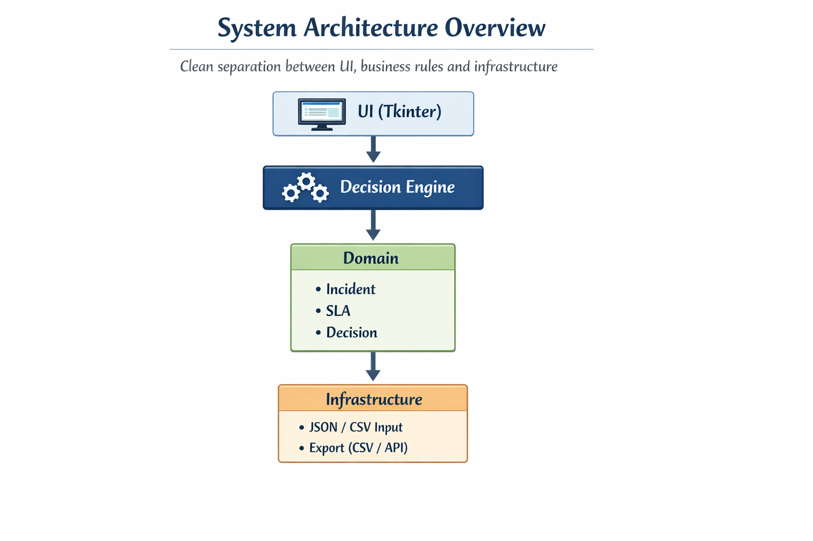
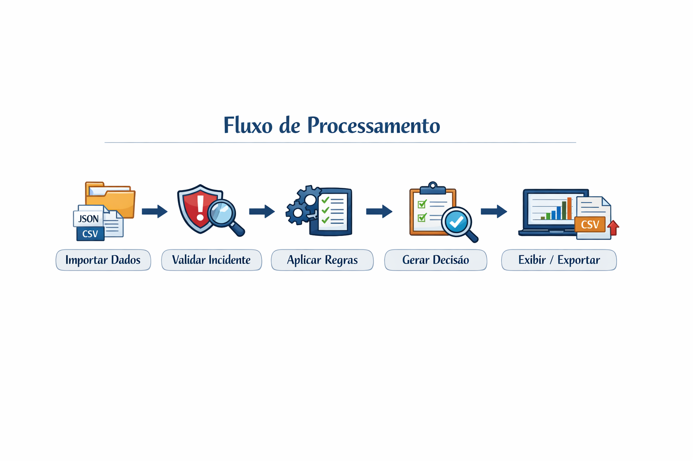

# Incident Decision Engine

O **Incident Decision Engine** é uma aplicação desenvolvida em **Python** para processar dados de incidentes e gerar decisões com base em regras de negócio explícitas.

Este projeto tem foco em **engenharia de software**, aplicando princípios de arquitetura limpa, separação de responsabilidades e documentação técnica adequada.

> Todos os dados utilizados são genéricos e anonimizados, sem qualquer vínculo com ambientes produtivos.

---

## 🎯 Objetivo Técnico

Simular um motor de decisão para cenários de gerenciamento de incidentes, avaliando múltiplos critérios de forma consistente e reutilizável, como:

- Métricas de SLA
- Atributos do incidente
- Regras de negócio configuráveis

Do ponto de vista técnico, o sistema foi projetado para:

- Centralizar a lógica de decisão
- Desacoplar regras de negócio de interface e infraestrutura
- Facilitar evolução arquitetural com baixo impacto

---

## 🏗️ Arquitetura do Sistema

A aplicação segue uma arquitetura em camadas, inspirada nos princípios de **Clean Architecture**, priorizando baixo acoplamento e alta coesão.



### Camadas

- **UI (Tkinter)**  
  Responsável exclusivamente pela interação com o usuário.

- **Decision Engine**  
  Orquestra o fluxo de tomada de decisão.

- **Domain**  
  Núcleo do sistema, contendo regras e entidades de negócio.

- **Infrastructure**  
  Gerencia entrada e saída de dados e detalhes técnicos externos.

---

## 🔄 Fluxo de Processamento



1. Importação de dados (JSON / CSV)
2. Validação do incidente
3. Aplicação das regras de negócio
4. Geração da decisão
5. Exibição ou exportação do resultado

---

## 📐 Decisões Arquiteturais

As decisões técnicas e arquiteturais do projeto estão documentadas em:

- `docs/decisions.md`

O documento segue o modelo de **Architectural Decision Records (ADR)**.

---

## 🚀 Tecnologias Utilizadas

- Python
- Tkinter
- JSON / CSV

---

## 📂 Estrutura do Projeto

```text
backlog_servicenow/
├── app/
├── domain/
├── engine/
├── infrastructure/
└── docs/
```

---

## 👤 Autor

Lucas Mattos. Arquivo criado com fins de estudo e prática de Engenharia de Software com boas práticas de Arquitetura.
